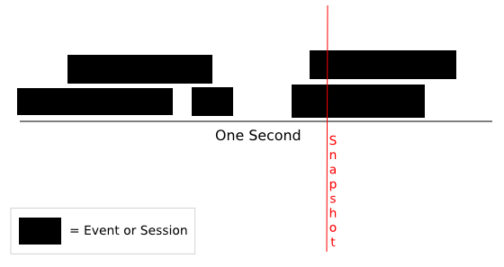

Concurrency and arrival rate
============================

* Concurrency is how many things are going on at a snapshot in time. 
* The Arrival rate is how many new things arrived during a window of time.

**for example:**

> 

> During the snapshot there were two concurrent events. The arrival rate during that entire second is 5 events, because there were 5 events that started throughout that second. The key relationship to grasp is that a large amount of concurrent connections can come from a high arrival rate and/or long lived connections (see [Little's Law][little]).

[little]: http://en.wikipedia.org/wiki/Little%27s_law
