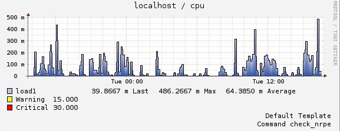

PNP4Nagios INFO
===============

* graph for 25 hours

>  

* hover in nagios 

>  

* template for graph at /opt/pnp4nagios/share/templates.dist/

such as: check_load.php

```php
<?php
#
# Copyright (c) 2006-2010 Joerg Linge (http://www.pnp4nagios.org)
# Plugin: check_load
#
$opt[1] = "--vertical-label Load -l0  --title \"CPU Load for $hostname / $servicedesc\" ";
#
#
#
$def[1]  = rrd::def("var1", $RRDFILE[1], $DS[1], "AVERAGE");
$def[1] .= rrd::def("var2", $RRDFILE[2], $DS[2], "AVERAGE");
$def[1] .= rrd::def("var3", $RRDFILE[3], $DS[3], "AVERAGE");

if ($WARN[1] != "") {
    $def[1] .= "HRULE:$WARN[1]#FFFF00 ";
}
if ($CRIT[1] != "") {
    $def[1] .= "HRULE:$CRIT[1]#FF0000 ";       
}
$def[1] .= rrd::area("var3", "#ff0000", "load 15") ;
$def[1] .= rrd::gprint("var3", array("LAST", "AVERAGE", "MAX"), "%6.2lf");
$def[1] .= rrd::area("var2", "#EA8F00", "Load 5 ") ;
$def[1] .= rrd::gprint("var2", array("LAST", "AVERAGE", "MAX"), "%6.2lf");
$def[1] .= rrd::area("var1", "#EACC00", "load 1 ") ;
$def[1] .= rrd::gprint("var1", array("LAST", "AVERAGE", "MAX"), "%6.2lf");
?>
```
